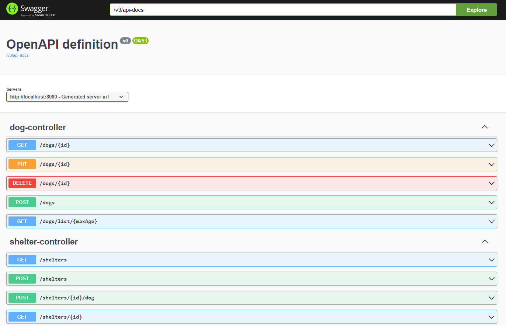

# Project "Microservice for CRUD operations with shelter for homeless dogs"

## How to run

*At this point you will need **JDK 19** to start the project. I am working on that.*

1. You need `postgres` image from official image of **docker hub** (https://hub.docker.com/_/postgres).

2. Start container creation from the command line. To do this, type ```docker-compose up -d``` in directory of project. Or use the capabilities of the IDE to start the docker container.

3. Start main method from class `SpringBootShelterApplication`.

4. Go to your browser and type `http::/localhost:8080/swagger-ui.html` in the search box. This will take you to the next page:



##### Now you can check other endpoints of my project. Thank you!

## About project
The project is for CRUD operations for a dog shelter. It 
organizes communication between two entities (dogs and shelters). 
They have a *one to many* and *many to one* relationship. 

(A little later a microservice responsible for authorizing users with 
different roles will be attached here. This microservice has already 
been implemented. Link: https://github.com/VladimirPopugaev/auth_service_elixir). 

Depending on the user's role, some functionality of the service will be available or not available to him.

## Technology stack

- Framework: Spring Boot 3
- Assembly system: Maven 4.0
- Architectural pattern: MVC
- Interaction interface: RESTful
- DBMS: PostgreSQL 13
- ORM framework: Hibernate 
- Containerization: Docker
- Java version: 19
- Version control system: Github