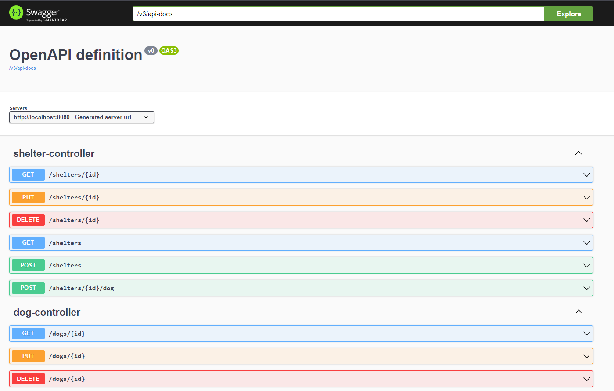
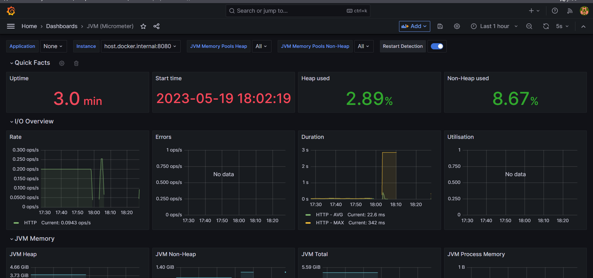

# Project "Microservice for CRUD operations with shelter for homeless dogs"

## How to run

1. Move the `docker-compose.yaml` file from the current directory (with the project) to 
the previous directory (`../`)

OR

1. Change the context paths for the build and config folders to the current directory 
(instead of `./spring_boot_shelter/` write `./`).

2. Start container creation from the command line. To do this, type ```docker-compose up --build -d``` 
in directory with `docker-compose.yml`.

3. Go to your browser and type `http::/localhost:8080/swagger-ui.html` in the search box. 
This will take you to the next page:



##### Now you can check other endpoints of my project. Thank you!

## Monitoring system

Prometheus and Grafana tools are used for system monitoring to graphically display.
To view the collected statistics, launch the application and go to `http://localhost:3000`

Two dashboards are collected automatically: one to collect *JVM statistics* and the other 
to collect *query statistics*

Below is a screenshot of the dashboard for collecting JVM statistics:



## CI/CD

When you change the master of a branch, three workflows are started:
1. Building the application and checking the amount of test coverage of the application.
2. Running the SonarCloud static analyzer
3. Building a Docker image and publishing it in DockerHub

## About project
The project is for CRUD operations for a dog shelter. It 
organizes communication between two entities (dogs and shelters). 
They have a *one to many* and *many to one* relationship. 

User authentication using an authorization microservice is used to access the methods.
In my case, this service is another project: https://github.com/VladimirPopugaev/auth_service_elixir
Interaction with the server is performed using WebClient.

## Technology stack

- Framework: Spring Boot 3
- Assembly system: Maven 4.0
- Architectural pattern: MVC
- Interaction interface: RESTful
- WebFlux: WebClient
- Testing: JUnit5, Mockito
- DBMS: PostgreSQL 13
- ORM framework: Hibernate 
- Containerization: Docker compose
- Logging system: log4j2 + ELK stack
- Monitoring system: Prometheus + Grafana
- Java version: 19
- Version control system: Github
